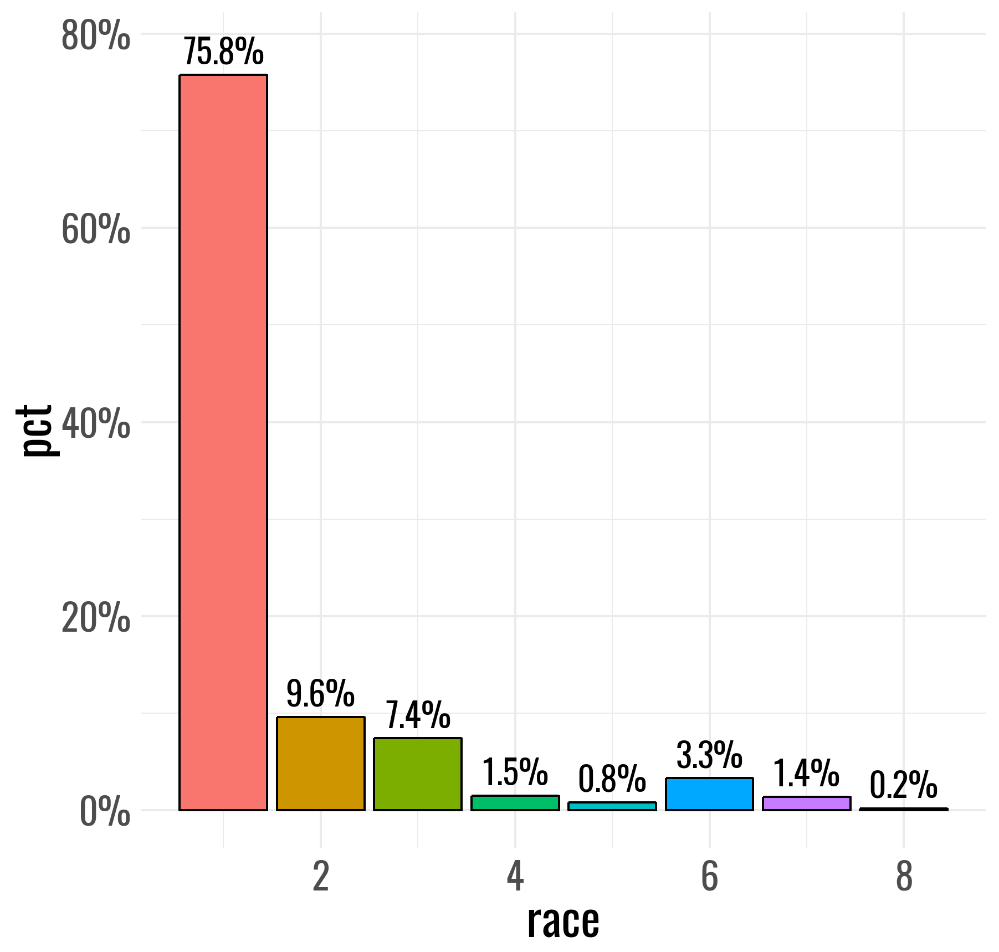

### Installation

You can install:

  - the latest development version from GitHub with
    
    ``` r
    install.packages("devtools")
    devtools::install_github("ryanburge/blocks/building")
    ```

### There are just a handful of functions to building right now

## Counting Things

I love the functionality of tabyl, but it doesn’t take a weight
variable. Here’s the simple version `ct()`

``` r
library(tidyverse)
library(building)
cces <- read_csv("https://raw.githubusercontent.com/ryanburge/blocks/master/cces.csv")

cces %>% 
  ct(race)
#> # A tibble: 8 x 3
#>    race     n   pct
#>   <int> <int> <dbl>
#> 1     1   368 0.736
#> 2     2    54 0.108
#> 3     3    38 0.076
#> 4     4    13 0.026
#> 5     5     7 0.014
#> 6     6     9 0.018
#> 7     7     8 0.016
#> 8     8     3 0.006
```

Note that you are presented with a count column and a pct column.

Let’s add weights

``` r
cces %>% 
  ct(race, commonweight_vv)
#> # A tibble: 8 x 3
#>    race       n   pct
#>   <int>   <dbl> <dbl>
#> 1     1 348.    0.758
#> 2     2  43.9   0.096
#> 3     3  34.0   0.074
#> 4     4   7.09  0.015
#> 5     5   3.87  0.008
#> 6     6  15.2   0.033
#> 7     7   6.33  0.014
#> 8     8   0.704 0.002
```

Notice that it’s pipeable. And if you don’t include the weight variable
then it won’t be calculated with a weight.

## Getting Confidence Intervals

Oftentimes in social science we like to see what our 95% confidence
intervals are, but that’s a lot of syntax. It’s easy with the `mean_ci`
function

``` r
cces %>% 
  mean_ci(gender)
#> # A tibble: 1 x 6
#>    mean    sd     n     se lower upper
#>   <dbl> <dbl> <int>  <dbl> <dbl> <dbl>
#> 1  1.54 0.499   500 0.0223  1.49  1.58
```

The default is a 95% confidence interval. However that can be changed
easily.

``` r
cces %>% 
  mean_ci(gender, .84)
#> # A tibble: 1 x 7
#>    mean    sd     n level     se lower upper
#>   <dbl> <dbl> <int> <dbl>  <dbl> <dbl> <dbl>
#> 1  1.54 0.499   500  0.16 0.0223  1.50  1.57
```

## Simple Mean and Median

I wanted a simple function to calculate the mean and the median. It
takes just one variable and computes both
statistics.

``` r
money1 <- read_csv("https://raw.githubusercontent.com/ryanburge/pls2003_sp17/master/sal_work.csv")

money1 
#> # A tibble: 1,025 x 3
#>       X1 salary names             
#>    <int>  <int> <chr>             
#>  1     1  14736 Darin Casem       
#>  2     2  21261 Jaelyn Groesbeck  
#>  3     3  16831 Theodis Butler    
#>  4     4  34400 Joewid Rettig     
#>  5     5  31239 Breianna Gilbert  
#>  6     6  51580 Marcus Gray II    
#>  7     7  49699 Berenice Garcia   
#>  8     8  66805 Elijah Garrett    
#>  9     9  49321 Jeremiah Bishop Jr
#> 10    10  67126 Sultana al-Jabbour
#> # ... with 1,015 more rows

money1  %>% 
  mean_med(salary)
#> # A tibble: 1 x 2
#>       mean median
#>      <dbl>  <int>
#> 1 1247953.  35853
```

## Making a quick visualization of a bar chart

I make a lot of really quick bar charts. Too many of them. So if I use
the `ct()` function, this moves easily into making a `geom_col()` type
bar chart. This gives a percentage annotation at the top of each bar.

``` r
a1 <- cces %>% 
  ct(race, commonweight_vv)

gg_col(a1, race, pct)
```

 <!-- -->

  - let me know what you think on twitter
    <a href="https://twitter.com/ryanburge">@ryanburge</a>
